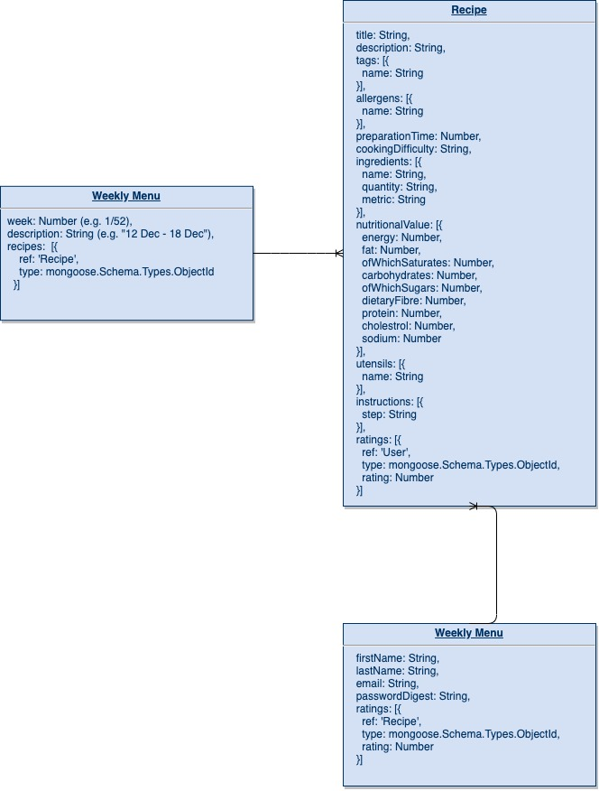

## Database overview

## Note
Due to knowledge gaps and time-restraints, I have not used Docker in my solution. I have therefore chosen to expose the `.env` file which contains the `MONGO_URI` and `SERVER_SECRET_KEY`. Normally, in the interest of security, I would always include the `.env` within `.gitignore`.

I have used a JavaScript stack as I was not exposed to Python in my studies. Whilst I was able to set up a virtual environment, a basic Python app, and Docker config to some extent, I did not feel that I could be able to deliver a solution that I would be satisfied with, let alone a complete one, in the given amount of time. I would love the opportunity to be able to learn Python properly.

Ideally, I would have liked to add an additional field to the `User` collection entitled `admin`, whose data type is a `Boolean`. This value could then be returned in the `JWT` in order to lock down certain admin routes, and separate an `admin` from a regular `user`. I was unable to complete this due to time restraints, however `checkAuth()` and the token signing in `PATCH /login/users` in `server.js` serve as a starting point. For the purposes of code cleanliness, I would also have liked to separate the `routes` into its own folder and import them into `server.js`.
